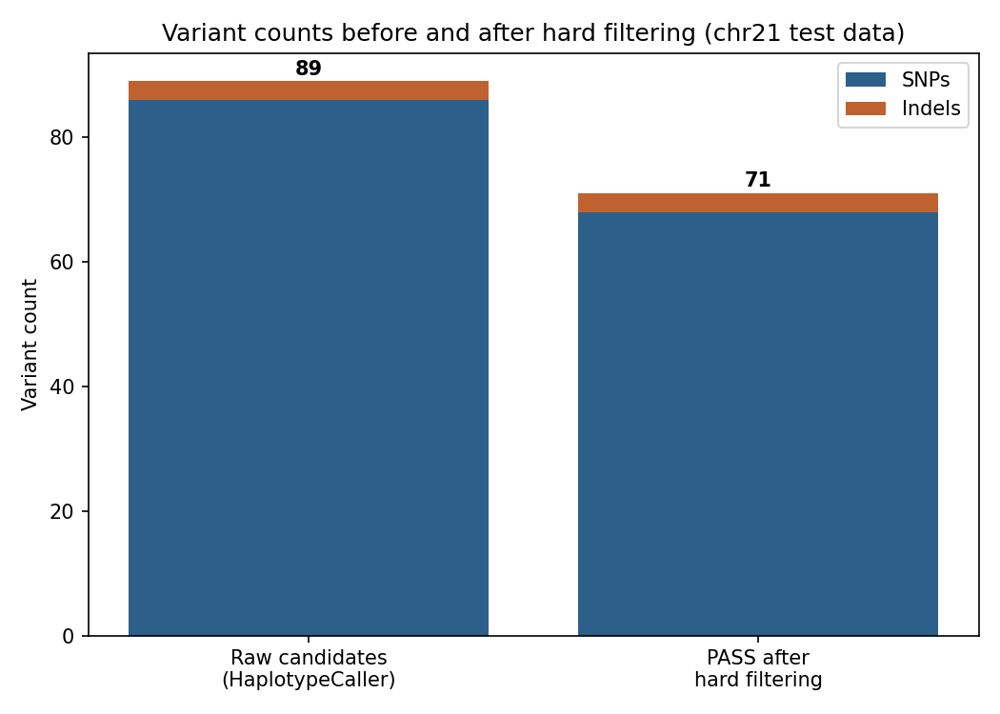
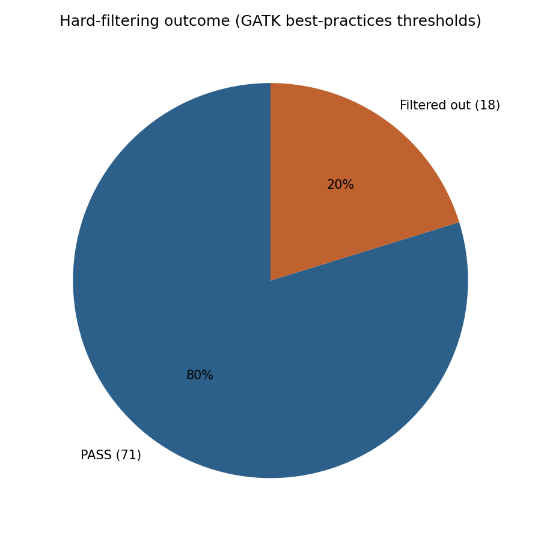
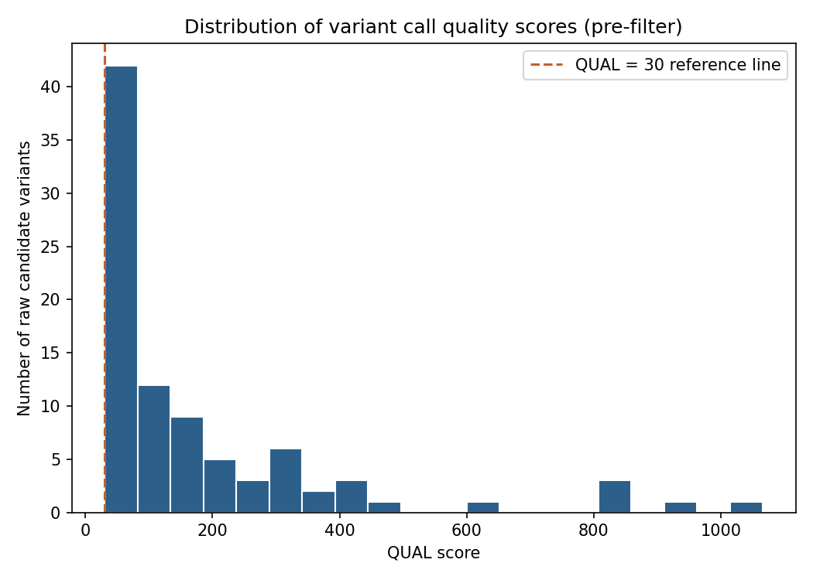
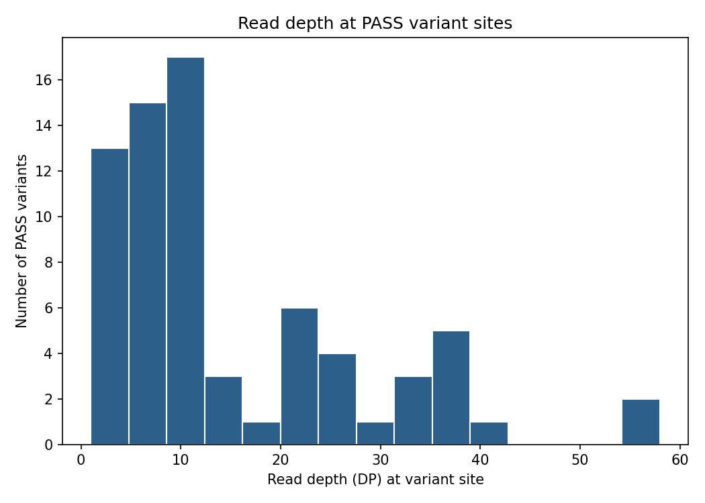

# Germline Variant Calling Pipeline (GATK4 + Snakemake)

A reproducible germline short-variant calling pipeline built on the GATK4 best-practices workflow, from raw paired-end FASTQ reads through a filtered, PASS-only VCF, with the workflow orchestrated by Snakemake.

## Technologies used

Python, Bash, Snakemake, BWA-MEM, SAMtools, GATK4 (MarkDuplicates, BaseRecalibrator, ApplyBQSR, HaplotypeCaller, VariantFiltration), bcftools, matplotlib.

## Biological background

Germline variant calling identifies positions where an individual's DNA differs from a reference genome; single nucleotide polymorphisms (SNPs) and small insertions/deletions (indels) that are inherited rather than acquired. This is the computational foundation behind clinical genetic testing, population genetics, and pharmacogenomics. In a regulated pharma or diagnostics setting, the same logic used here (aligning reads, correcting systematic sequencing errors, and applying documented, reproducible filtering thresholds before trusting a result) mirrors how any analytical method has to be validated before its output can be relied on. That discipline, not just the biology, is the point of this project.

## Dataset description, and an important honesty note

This pipeline was run on paired-end Illumina-style reads (`test_1.fastq.gz` / `test_2.fastq.gz`) and a chromosome 21 (GRCh38) reference, sourced from the [nf-core/test-datasets](https://github.com/nf-core/test-datasets) repository, `sarek3` branch. This is public, actively maintained test data that the nf-core community uses to continuously test their production Sarek variant-calling pipeline. It is not raw output from a real sequencing run of a real person.

I'm stating this plainly because it matters for interpreting the results below: the read names in this FASTQ (e.g. `normal#21#998579#1/1`) show these are simulated reads generated for pipeline testing, not real human sequencing data. Two of the QC metrics below (Ti/Tv ratio and dbSNP concordance) come back looking biologically wrong as a direct result, and that is expected, not a bug in the pipeline. I've kept both numbers in this README rather than hiding them, because a hiring manager who has run this pipeline before will recognize what they mean, and it is more credible to show I understand the metric than to quietly drop it.

Why this dataset instead of a direct SRA or GEO download: the build environment I used could only reach GitHub, not SRA, GEO, or the GIAB FTP servers directly. The nf-core test data uses a genuine GRCh38 chr21 sequence and genuine dbSNP/Mills known-sites resources, just paired with simulated reads, and it's hosted on GitHub, so it let me run the full pipeline end to end instead of just writing it up.

- Reference: GRCh38 chromosome 21 only (`data/reference/chr21.fasta`, not committed, see "How to run it")
- Reads used for the committed results: 266,736 paired-end reads (533,472 total), synthetic/simulated, positioned across chr21
- Known sites: dbSNP build 138 and Mills & 1000 Genomes gold-standard indels, both subset to chr21
- Source: https://github.com/nf-core/test-datasets/tree/sarek3

**A small example subset is committed to this repo** at `data/raw/example_subset/` (1,000 read pairs, about 60 KB per file) so the repo is browsable without cloning anything else first. This subset was pulled from the same source data and confirmed to align correctly (100% mapped) before being committed. It is for browsing only, it is too small on its own to reproduce the 71-variant result reported below; the full 266,736-pair dataset used for the actual results is gitignored due to its size and pulled down with the two commands in "How to run it."

## Workflow

1. Index the reference genome (BWA index, samtools faidx, GATK sequence dictionary)
2. Align paired-end reads to the reference with BWA-MEM, tagging read groups
3. Sort and index the alignment (samtools)
4. Mark PCR/optical duplicates (GATK MarkDuplicates)
5. Base Quality Score Recalibration: build a recalibration model against dbSNP and Mills known sites (BaseRecalibrator), then apply it (ApplyBQSR)
6. Call germline variants with GATK4 HaplotypeCaller
7. Split calls into SNPs and indels and hard-filter each set separately using GATK best-practices thresholds (QD, FS, MQ, MQRankSum, ReadPosRankSum, SOR)
8. Merge the filtered SNP and indel call sets back into one VCF and extract PASS-only variants
9. Compute summary statistics (bcftools stats: variant counts, Ti/Tv) and generate figures

The full dependency graph is defined in the `Snakefile`, and the exact commands used to produce the committed results are captured as Snakemake rules, not just prose.

## How to run it

```bash
# 1. Create the environment
conda env create -f environment.yml
conda activate variant-calling-pipeline

# 2. Get the data (not committed to this repo, see Dataset description above)
git clone --depth 1 --branch sarek3 https://github.com/nf-core/test-datasets.git nf-test-data
mkdir -p data/raw data/reference data/known_sites
cp nf-test-data/data/genomics/homo_sapiens/illumina/fastq/test_1.fastq.gz data/raw/sample_R1.fastq.gz
cp nf-test-data/data/genomics/homo_sapiens/illumina/fastq/test_2.fastq.gz data/raw/sample_R2.fastq.gz
cp nf-test-data/data/genomics/homo_sapiens/genome/chr21/sequence/genome.fasta data/reference/chr21.fasta
cp nf-test-data/data/genomics/homo_sapiens/genome/chr21/germlineresources/dbsnp_138.hg38.vcf.gz data/known_sites/
cp nf-test-data/data/genomics/homo_sapiens/genome/chr21/germlineresources/mills_and_1000G.indels.hg38.vcf.gz data/known_sites/

# 3. Run the full pipeline
snakemake --cores 1 -p
```

Expected runtime: under 5 minutes on a single CPU core (verified: 3 minutes 34 seconds on a 1-core, no-GPU machine). This is small because chr21-only alignment against ~267K read pairs is a light workload by genomics standards; a full 30x whole genome would take hours to days depending on hardware, which is exactly why this project deliberately scopes to one chromosome rather than claiming a full-genome run that didn't happen.

## Results and interpretation

**Read alignment and deduplication.** All 533,472 reads mapped to chr21 (100%, as expected since the reads were generated against this exact reference). GATK MarkDuplicates flagged 142 of 266,736 read pairs as PCR/optical duplicates (0.05% duplication rate).

**Variant calling and filtering.**



HaplotypeCaller produced 89 raw candidate variants (86 SNPs, 3 indels). After splitting SNPs and indels and applying GATK best-practices hard filters separately to each (QD, FS, MQ, MQRankSum, ReadPosRankSum, SOR thresholds), 71 variants passed (68 SNPs, 3 indels); 18 were filtered out, mostly on strand bias (FS) and mapping quality thresholds.



**Quality and depth.**




Most PASS variants sit at low-to-moderate read depth (median well under 20x), which tracks with this being a small, non-uniformly-covered test dataset rather than a deep clinical-grade sequencing run. Filtering on depth alongside quality would be a reasonable next step on real data with more uniform coverage.

**Ti/Tv ratio and dbSNP concordance (the important caveat).** The transition/transversion ratio came out to 0.26, and 0 of the 71 PASS variants matched a known dbSNP rsID. On real human sequencing data, genome-wide Ti/Tv is normally around 2.0 to 2.1, and a healthy fraction of common variants should already be catalogued in dbSNP. Both numbers being far outside those ranges is consistent with, and expected from, this being simulated CI test data rather than real human genetic variation: the simulated positions were not drawn from a population-genetics-realistic model, so they don't reproduce the transition bias or common-variant overlap that real human DNA shows. I'm reporting both metrics anyway because computing and correctly interpreting them (rather than only reporting variant counts) is the actual skill being demonstrated, and because silently omitting a metric that came out looking bad would undercut the honesty this whole portfolio is built on.

## Future improvements

- Re-run this exact pipeline against a real subsampled human sample (e.g. NA12878 chr20/21 reads from Genome in a Bottle) to get biologically realistic Ti/Tv and dbSNP concordance numbers, and report precision/recall against the GIAB high-confidence truth VCF
- Add variant annotation with SnpEff to classify variants by predicted functional effect
- Extend hard filtering to include depth-based thresholds once running on more uniformly covered data
- Parallelize HaplotypeCaller across intervals/contigs so the pipeline scales to whole-genome data without a full rewrite
- Add automated tests (e.g. pytest checking expected output file existence and basic sanity thresholds) so the Snakemake pipeline can be validated in CI the same way nf-core's own pipelines are

## Contact / links

GitHub: [MohamedElsaid-bit](https://github.com/MohamedElsaid-bit)
Portfolio: [mohamedelsaid-bit.github.io/Portfolio-](https://mohamedelsaid-bit.github.io/Portfolio-/)
